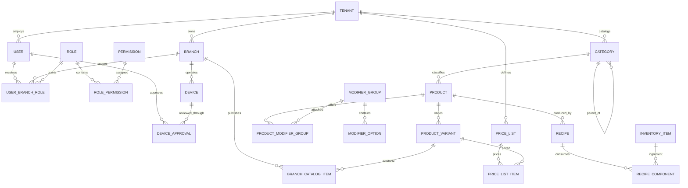
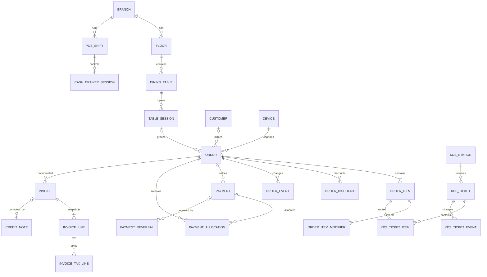
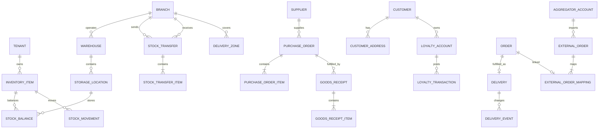
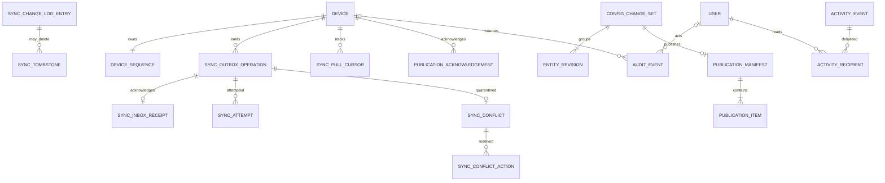
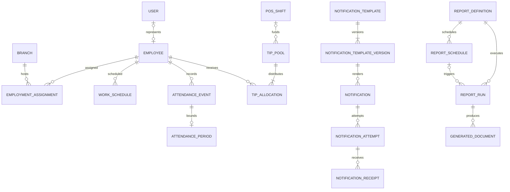

# ER Diagrams

Diagrams are intentionally bounded; the schema catalog remains authoritative for columns,
scope, indexes, and delete behavior. `TENANT` represents a restaurant company.

## Platform, Identity & Catalog

## POS, Kitchen & Billing

## Inventory, Procurement, CRM & Delivery

## Synchronization, Versioning & Audit

## Workforce, Notifications & Reporting

## Cardinality Rules

- A company owns many branches; a branch belongs to exactly one company.
- Company-level masters are shared only through branch override/publishing tables.
- Users are company-owned and gain branch access only through active role grants.
- Orders, devices, tables, shifts, KDS, warehouses, deliveries, and ledgers are branch-owned.
- Transfers are company-owned and reference two branches of the same company.
- Historical, financial, stock, sync receipt, and audit records are append-only.
- Generic audit/translation targets are logical references; every other relationship uses an
  enforced scope-aware foreign key unless explicitly identified as an external-system ID.